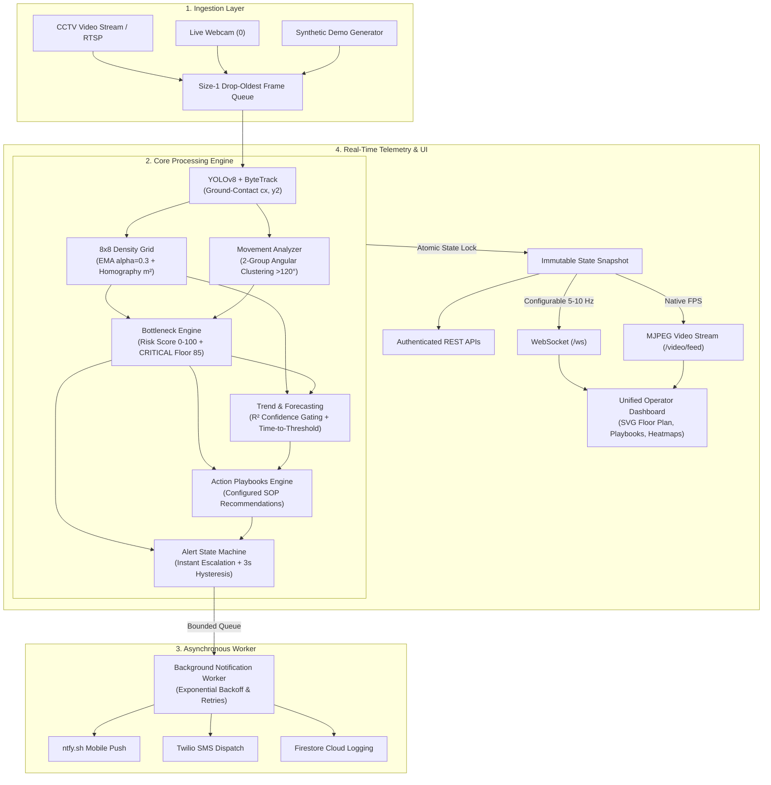

# 🛡️ CrowdSense — Intelligent Crowd Safety & Proactive Incident Prevention Platform

> **"CrowdSense turns CCTV into a 30-second early-warning system: it measures how crowds move, not just how many there are, and tells operators where the problem is, how long they have, and what to do."**

---

## 🌟 Key Features & Capabilities

- **High-Precision Ground Mapping**: YOLOv8 Person Detection + ByteTrack tracking with foot-contact point mapping $(c_x, y_2)$ and optional 4-point homography calibration for physical $\text{people}/m^2$ metrics.
- **8×8 Spatial Density Grid & EMA Smoothing**: Temporal smoothing $(\alpha = 0.3)$ to eliminate high-frequency noise and false spikes.
- **Angular Movement Vector Clustering**: Resolution-independent normalized velocity $(\%/s)$ with 2-group angular clustering detecting opposing crowd flows ($>120^\circ$ separation) even when net average velocity cancels to zero.
- **Multi-Signal Bottleneck Engine**: 0–100 per-zone risk scoring incorporating density, accumulation velocity, movement stagnation, opposing flow, and unified persistence timers with guaranteed $\ge 85$ score flooring on extreme cell crowding.
- **Proactive Risk & Count Forecasting**: $R^2$-gated short-term linear regression forecasting risk score escalation and projecting actionable countdowns (`time_to_threshold_sec`).
- **Resilient Alert State Machine**: Per-zone finite state machine with instant escalation during cooldown, 3-second 5-point de-escalation hysteresis to prevent flapping, single active incident tracking, and non-blocking worker thread notification dispatch.
- **Action Playbooks & Venue Floor Plan**: Automatic operator action recommendations mapped to detected congestion reasons, paired with an interactive SVG floor plan visualization.
- **Hardened Architecture**: Atomic state snapshot publishing, size-1 drop-oldest video queues, API key authentication, and zero facial recognition / biometric privacy compliance.

---

## 🏗️ System Architecture



---

## 📊 Core Algorithms & Formulations

### 1. Ground Contact & Physical Homography Calibration
Foot positions $(c_x, y_2)$ are mapped to grid cells or real-world floor coordinates using perspective homography $H$:
$$\begin{bmatrix} X_{ground} \\ Y_{ground} \\ 1 \end{bmatrix} \sim H \begin{bmatrix} c_x \\ y_2 \\ 1 \end{bmatrix}$$
When homography is uncalibrated, a per-row perspective weight scales detection counts to prevent distant crowd underestimation:
$$w(r) = 1.0 + 0.08 \times (7 - r)$$

### 2. Angular Opposing Flow Clustering
Vectors exceeding minimum speed ($1.0\ \%/s$) are clustered into primary directional groups. Opposing flow is triggered when each group holds $\ge 25\%$ of vectors ($\ge 2$ tracks) and the angle between group mean headings satisfies:
$$\Delta\theta = \arccos\left(\frac{\vec{u}_1 \cdot \vec{u}_2}{\|\vec{u}_1\| \|\vec{u}_2\|}\right) > 120^\circ$$

### 3. Multi-Signal Bottleneck Scoring & CRITICAL Override
Risk score aggregates five normalized signals:
$$\text{Score} = \min\Big(S_{\text{density}}(40) + S_{\text{growth}}(20) + S_{\text{stagnation}}(20) + S_{\text{opposing}}(10) + S_{\text{persistence}}(10), 100\Big)$$
*Critical Safeguard*: If any single grid cell reaches $\ge 7$ individuals, score is immediately floored at $85$ (`CRITICAL_CELL_CONCENTRATION`).

### 4. Proactive Linear Trend & Forecast Countdown
Fit quality is validated using coefficient of determination $R^2$:
$$R^2 = 1 - \frac{\sum (y_i - \hat{y}_i)^2}{\sum (y_i - \bar{y})^2}, \quad \text{marked low confidence when } R^2 < 0.40$$
When trending upward, estimated time to next risk threshold is computed:
$$T_{\text{threshold}} = \max\left(\frac{\text{Threshold} - \text{Score}_t}{m}, 0\right)$$

---

## 🧪 Comprehensive Verification & Benchmarks

| Category | Identifier | Test / Scenario Name | Expected Behavior | Status |
| :--- | :--- | :--- | :--- | :--- |
| **Static & Linters** | `CHK-01` | Python Compileall | Zero syntax errors | **PASS** |
| | `CHK-02` | Flake8 / Ruff Static Linter | Clean imports & undefined variables | **PASS** |
| | `CHK-03` | Node.js Frontend Check | Valid vanilla JS syntax | **PASS** |
| **Unit Tests** | `UT-01` | `test_grid_density.py` | 8x8 EMA smoothing & cell mapping | **PASS** |
| | `UT-02` | `test_movement.py` | Velocity & 2-group opposing flow clustering | **PASS** |
| | `UT-03` | `test_bottleneck.py` | Risk scoring & CRITICAL 85 score override | **PASS** |
| | `UT-04` | `test_prediction.py` | Zero-variance $R^2$ guard & forecast countdown | **PASS** |
| | `UT-05` | `test_alerts.py` | Escalation cooldown bypass & 3s hysteresis | **PASS** |
| | `UT-06` | `test_api.py` | Auth token validation & REST endpoints | **PASS** |
| | `UT-07` | `test_contract.py` | JSON payload schema backward compatibility | **PASS** |
| | `UT-08` | `detect_and_track` | Real YOLOv8 person tracking check | **PASS** |
| **Scenarios** | `S1–S11` | Core Scenarios | Empty, spread, surge, congestion, ACK, resolution | **PASS** |
| | `S12` | Opposing Flow Clustering | Two opposing streams cancel to zero mean | **PASS** |
| | `S13` | Cooldown Escalation | HIGH to CRITICAL dispatches immediately | **PASS** |
| | `S14` | De-escalation Hysteresis | Suppresses threshold flapping for 3s | **PASS** |
| | `S15` | Zero-Variance Trend | Safe constant count regression ($R^2=1.0$) | **PASS** |
| | `S16` | Score Override Consistency | Max cell $\ge 7$ guarantees score $\ge 85$ | **PASS** |
| | `S17` | Twilio Lifecycle Sequence | NORMAL -> HIGH -> CRITICAL -> NORMAL | **PASS** |
| **Benchmark** | `EVAL` | `scripts/evaluate.py` | Early warning lead time $\ge 12\text{s}$, MAE $\le 3.8$ | **PASS** |

---

## 📱 Twilio SMS & WhatsApp Setup

CrowdSense delivers instant automated SMS or WhatsApp notifications to security personnel and incident response teams when crowd density or congestion metrics exceed safety limits.

### 1. Twilio Account & API Key Configuration
1. Sign up or log in at [twilio.com](https://www.twilio.com).
2. Retrieve your **Account SID** from the Twilio Console.
3. (Recommended) Generate an API Key under **Account > API keys & tokens** (`TWILIO_API_KEY_SID` and `TWILIO_API_KEY_SECRET`). Alternatively, use `TWILIO_AUTH_TOKEN`.
4. Obtain a Twilio phone number or Messaging Service SID.

### 2. Environment Variables (`.env`)
Copy `.env.example` to `.env` and fill in your values:
```env
# Twilio Account & Auth
TWILIO_ACCOUNT_SID=your_account_sid_here
TWILIO_API_KEY_SID=your_api_key_sid_here
TWILIO_API_KEY_SECRET=your_api_key_secret_here
# Or fallback:
TWILIO_AUTH_TOKEN=your_auth_token_here

# Sender & Channel
TWILIO_FROM_NUMBER=+15005550006
TWILIO_CHANNEL=sms   # Options: sms | whatsapp

# Recipient Phone Numbers (E.164 format)
ALERT_PHONE_NUMBERS=+919876543210,+14155552671

# Optional Per-Zone Routing (JSON format)
ZONE_RECIPIENTS={"ZONE_A": ["+919876543210"], "ZONE_B": ["+14155552671"]}

# Alert Throttling & Filtering
SMS_MIN_LEVEL=HIGH            # Minimum level to trigger: HIGH, CONGESTION, CRITICAL
SMS_COOLDOWN_SEC=30           # Repeat alert cooldown per zone
SMS_SEND_RESOLVED=true        # Dispatch resolution SMS when zone returns to NORMAL
```

> [!NOTE]
> **Trial Account Limitations**:
> - Trial accounts can only send SMS to **verified caller IDs** added in the Twilio Console.
> - Outbound trial messages will contain the standard Twilio prefix `Sent from your Twilio trial account -`.

> [!IMPORTANT]
> **India Telecom Regulation & WhatsApp Sandbox Demo**:
> - Sending SMS to Indian (+91) numbers requires **TRAI/DLT (Distributed Ledger Technology) Entity and Template Registration**. Unregistered SMS to Indian numbers may fail or be filtered by telecom operators.
> - For instant demos and local evaluation in India without DLT registration, use the **Twilio WhatsApp Sandbox**:
>   1. Set `TWILIO_CHANNEL=whatsapp` in `.env`.
>   2. Set `TWILIO_FROM_NUMBER=+14155238886` (Twilio WhatsApp sandbox number).
>   3. Have security recipients send the sandbox join keyword (e.g., `join <sandbox-keyword>`) to `+14155238886`.

### 3. Testing Notifications
Send an instant test alert via the authenticated REST endpoint:
```bash
# Using Header Key:
curl -X POST http://localhost:8000/api/notify/test -H "x-api-key: your_api_auth_key"

# Using Query Token:
curl -X POST "http://localhost:8000/api/notify/test?token=your_api_auth_key"
```

Verify service status via `/api/health`:
```json
{
  "status": "HEALTHY",
  "sms": "ENABLED",
  "twilio": "ENABLED"
}
```

---

## 🚀 Deployment & Operations

### Local Development
```bash
# 1. Activate virtual environment
.\venv\Scripts\activate

# 2. Run test suite
python -m pytest tests/

# 3. Launch dashboard
python dashboard.py
```

### Production Docker Container
```bash
# Build and launch via Docker Compose
docker-compose up --build -d
```

> **Note on Serverless Environments (Vercel)**:  
> As documented in [app.py](file:///c:/Users/HARSH/Desktop/crowdsense%20harsh/app.py), computer vision pipelines with persistent WebSockets and video capture require continuous runtimes (Docker, VM, or Edge). Vercel is supported exclusively for static frontend previews.

---

## 🔒 Privacy & Compliance

CrowdSense is engineered strictly for crowd safety and spatial physics. Please refer to [PRIVACY.md](file:///c:/Users/HARSH/Desktop/crowdsense%20harsh/PRIVACY.md) for full compliance details:
- **No Facial Recognition**: Detections identify person bounding boxes only.
- **No Identity Persistence**: Anonymous integer track IDs are ephemeral.
- **Zero Video Archiving**: Raw video frames are processed in-memory and discarded.

---

## 🚀 How to Run

### 1. Primary Control Center Web Dashboard (Recommended)
```bash
# Direct python execution (prints URL http://localhost:8000)
python dashboard.py

# With DEMO simulation mode
python dashboard.py --demo

# Or via Uvicorn CLI
uvicorn dashboard:app --host 0.0.0.0 --port 8000
```
Open **`http://localhost:8000`** in your browser.

### 2. Streamlit Live Monitoring Application
```bash
streamlit run app.py
```

### 3. Standalone OpenCV Window Mode
```bash
python crowdsense.py [--demo]
```

---

## 🧪 Testing & Verification

Run the complete self-verification test suite (Static checks, Pytest unit tests, Contract tests, Scenarios S1–S11, Real Server startup check):
```bash
python scripts/verify_all.py
```

Or run unit tests directly via Pytest:
```bash
pytest tests/
```

---

## ⚠️ Safety & Prototype Disclaimer

> **Important Safety Note**: All risk scores, congestion warnings, and trend estimates generated by CrowdSense are **prototype risk indicators**. The platform does NOT claim to prevent stampedes or guarantee 100% detection accuracy. All automated alerts **require human verification** by trained safety operators before initiating physical crowd control measures.
